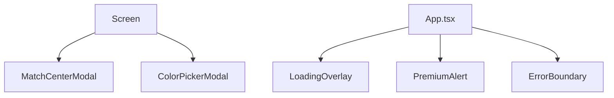
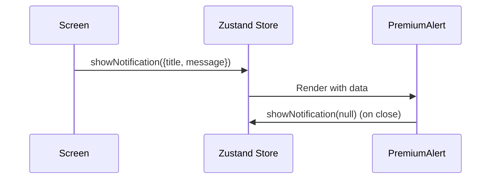

# Components

Components are reusable UI elements and functional modules that support the Screens. They range from simple visual wrappers to complex interactive modals.

## Responsibility

Shared components are responsible for:
- Providing consistent UI patterns (Modals, Loaders, Alerts).
- Encapsulating specific, repeatable logic (e.g., Color picking, Match event recording).
- Handling global cross-cutting concerns (e.g., Error boundaries, Loading overlays).

## Architecture



## Key Files

- `src/components/MatchCenterModal.tsx` — A complex modal for recording match scores, events (goals, cards), and manual player votes. Interacts with `leagueSlice` and `fantasySlice`.
- `src/components/ColorPickerModal.tsx` — A custom HSV-based color picker used for league settings and custom roles.
- `src/components/PremiumAlert.tsx` — A global notification component that displays success, error, and confirmation messages. Driven by the `uiSlice`.
- `src/components/ErrorBoundary.tsx` — Catches JavaScript errors in the component tree and displays a fallback UI.
- `src/components/LoadingOverlay.tsx` — A global full-screen spinner managed by the store's `isLoading` state.

## Primary Flow

### Notification Flow



## Connection to Zustand Store

Components connect to the store for either global orchestration or for updating specific entities during complex interactions.

### Global UI Control
`PremiumAlert.tsx` and `LoadingOverlay.tsx` are mounted at the root in `App.tsx` and react to state changes in the `uiSlice`.

### Targeted Updates
`MatchCenterModal.tsx` uses `useStore.getState().updateMatch` to persist changes immediately as events are recorded:
```typescript
// src/components/MatchCenterModal.tsx
const updateMatch = (updated: Match) => {
    useStore.getState().updateMatch(updated);
};
```

## Related Documents

- [Screens](../screens/README.md)
- [Zustand Store](../../src/store/README.md)
