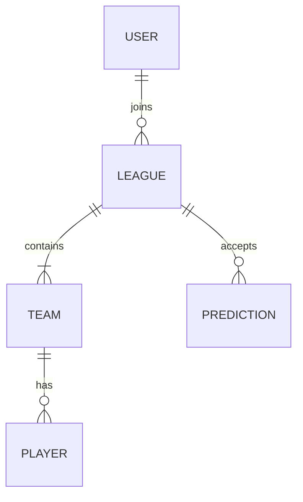

# Data Model

The application manages data across Supabase (remote) and Zustand (local state).

## Entity Relationship (Conceptual)

## Local State (Zustand Slices)

### `authSlice`
- `user`: User object | null
- `session`: Session | null

### `leagueSlice`
- `leagues`: Array of leagues
- `activeLeague`: Currently selected league

## Remote Schema (Supabase)

### `profiles`
- `id` (UUID, PK) — User ID from Auth
- `username` (Text) — Display name

### `leagues`
- `id` (UUID, PK)
- `name` (Text)
- `admin_id` (UUID, FK)
