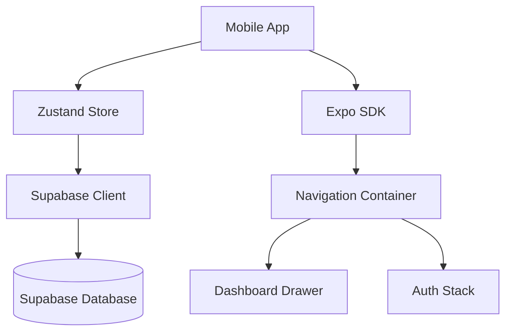
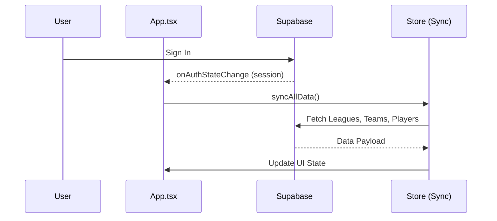

# High-Level Design

A React Native mobile application for managing fantasy football leagues, integrating with Supabase for data persistence and real-time updates.

## Architecture Overview

## Components

- **screens** (`src/screens/`) — View layer handling user interaction. Includes `AuthScreen`, `LeaguesScreen`, `DashboardScreen`, `SquadScreen`, etc.
- **store** (`src/store/`) — Global state managed via Zustand. Slices include `authSlice`, `leagueSlice`, `fantasySlice`, `predictionSlice`, `adminSlice`, `uiSlice`, and `syncSlice`.
- **lib** (`src/lib/`) — Infrastructure layer. `supabase.ts` for client config, `api.ts` for database wrappers, and `error-handler.ts`.
- **navigation** (`src/navigation/`) — Defines the app's routing hierarchy using React Navigation (Stacks and Drawers).
- **components** (`src/components/`) — Shared UI elements like `LoadingOverlay`, `ErrorBoundary`, and `MatchCenterModal`.

## Key Design Decisions

- **State Management:** Zustand with domain-specific slices for performance and simplicity.
- **Data Synchronization:** Automatic data sync triggered by Supabase auth state changes (`App.tsx:syncAllData`).
- **Persistence:** Local session persistence handled by Supabase client (likely using AsyncStorage).

## Data Flow

### Auth & Sync Flow

## Cross-Cutting Concerns

- **Error handling:** Centralized in `src/lib/error-handler.ts` and caught at the UI level by `src/components/ErrorBoundary.tsx`.
- **Global UI State:** `uiSlice` manages global loading states and notifications.
- **Authentication:** Gated at the navigation level in `App.tsx`.

## Related Documents

- [Screens](screens/README.md)
- [Store](store/README.md)
- [Lib](lib/README.md)
