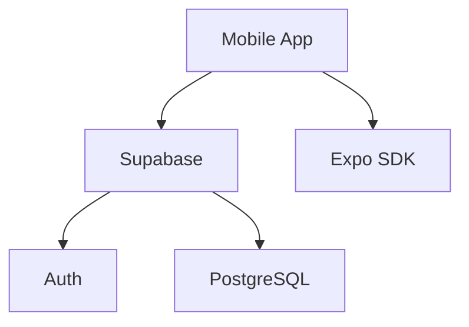

# External Integrations

Dependencies on external services and native Expo modules.

## Service Catalog

| Service | Purpose | Used by |
|---------|---------|---------|
| Supabase | Backend as a Service | `lib/supabase.ts` |
| Expo Image Picker | Media uploads | `screens/SquadScreen.tsx` |
| Expo Secure Store | Sensitive persistence | `lib/supabase.ts` (implied) |

## Dependency Map

