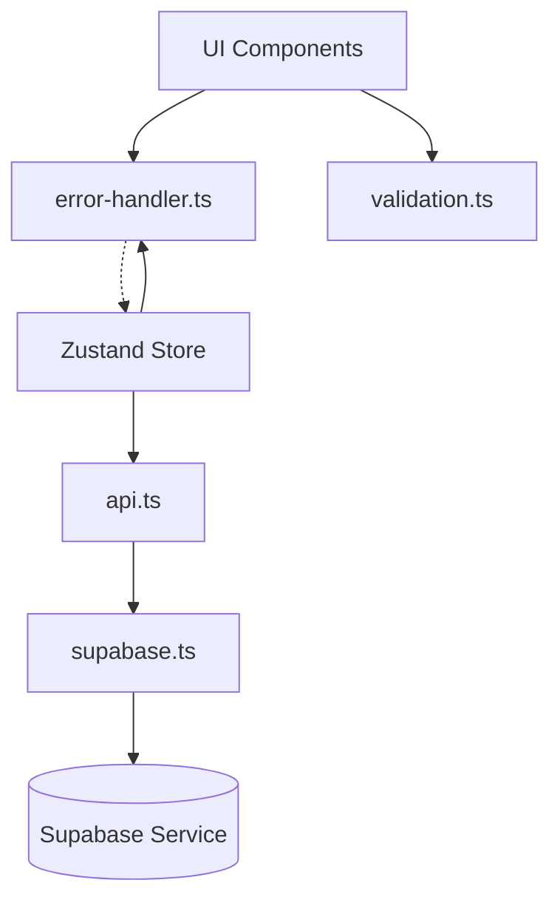
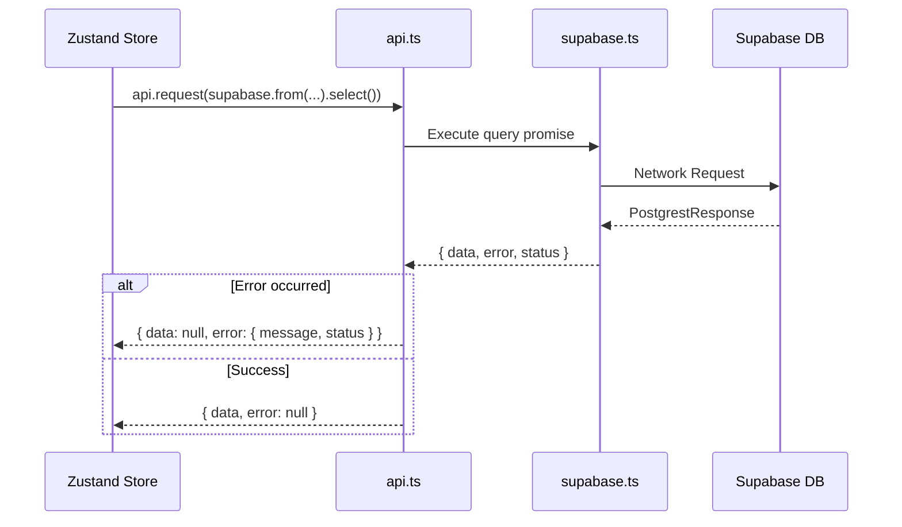
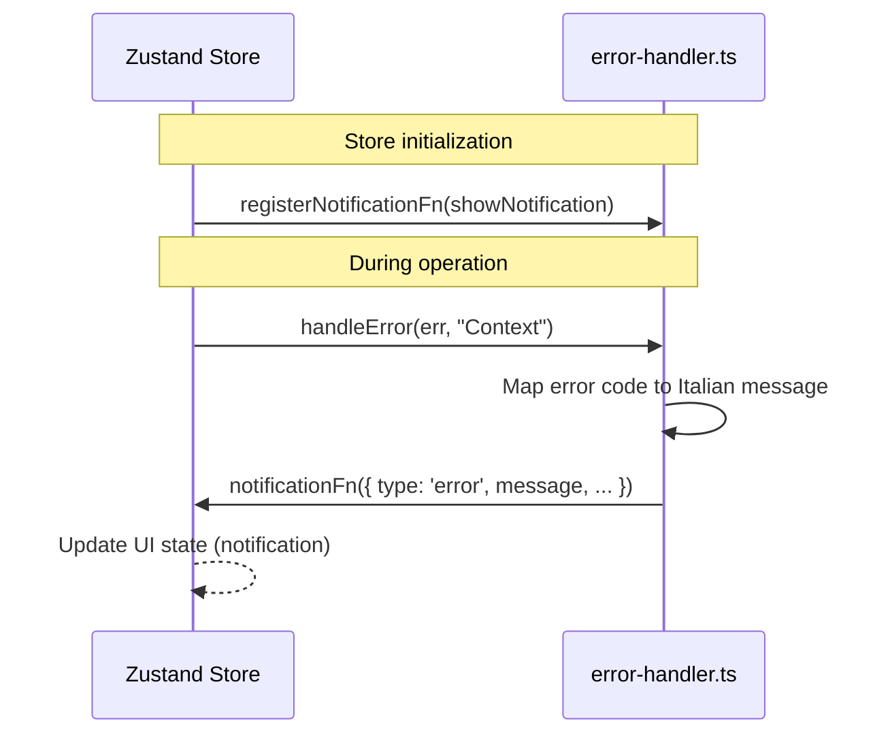

# Lib Component

The `lib` directory contains core infrastructure, utilities, and external service clients used throughout the application.

## Responsibility
This component is responsible for managing communication with external services (Supabase), providing centralized error handling, and implementing common validation logic. It acts as the bridge between the application state/UI and external data sources or system-level services.

## Architecture

## Key Files
- `src/lib/supabase.ts`: Initializes the Supabase client with React Native specific configuration (AsyncStorage).
- `src/lib/api.ts`: Standardizes API requests and responses using the `ApiResult<T>` type.
- `src/lib/error-handler.ts`: Maps technical errors to user-friendly messages and integrates with the store's notification system.
- `src/lib/validation.ts`: Contains pure functions for data validation (email, age, league settings).

## Key Interfaces / Types
- `src/lib/api.ts:ApiResult`: The standard wrapper for all API responses, containing `data` and `error` objects.
- `src/lib/error-handler.ts:AppError`: Interface for processed application errors.

## Flows

### Standard API Request Flow

### Centralized Error Handling Flow

## Configuration
The component relies on the following environment variables (defined in `.env` and accessed via `process.env`):
- `EXPO_PUBLIC_SUPABASE_URL`: The Supabase project URL.
- `EXPO_PUBLIC_SUPABASE_ANON_KEY`: The Supabase anonymous API key.

## Dependencies
- `@supabase/supabase-js`: Official Supabase client.
- `@react-native-async-storage/async-storage`: For persisting the Supabase session.
- `react-native-url-polyfill`: Required for Supabase client in React Native.

## Error Handling
Errors are caught in the `api.ts:request()` method and standardized. Higher-level errors (e.g., in store actions) are passed to `error-handler.ts:handleError()`, which performs:
1. Console logging with context.
2. User-friendly message mapping based on status codes (401, 403, 404, 422, etc.) or Postgrest error codes (e.g., '23505' for unique constraint violation).
3. Dispatching notifications to the UI.

## Related Documents
- [High-Level Design](../high-level-design.md)
- [Store Component](../store/README.md)
