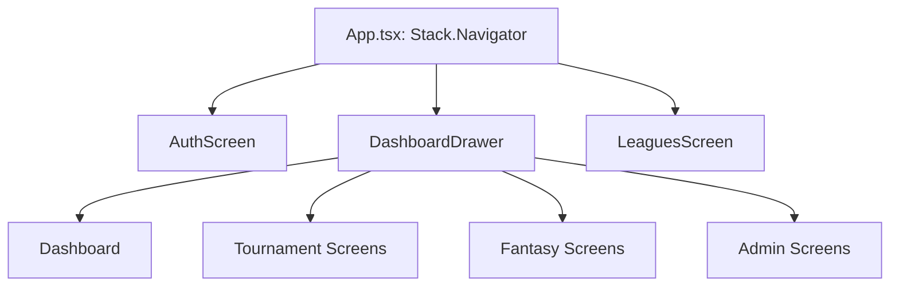
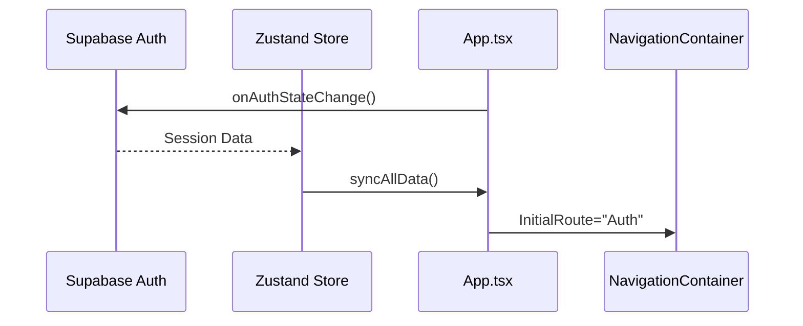

# Navigation

The navigation system manages the routing and screen transitions within the Fantalega Mobile app. It uses React Navigation to separate the authentication flow from the main application experience.

## Responsibility

The navigation layer is responsible for:
- Defining the app's routing structure (Stacks, Drawers).
- Controlling access to screens based on authentication state.
- Providing a consistent navigation UI (Drawer, Headers).
- Handling deep linking and parameter passing between screens.

## Architecture



## Key Files

- `App.tsx` — The root component containing the main `NativeStackNavigator`. It determines whether to show the Auth flow or the main App flow.
- `src/navigation/DashboardDrawer.tsx` — The primary navigation hub for users who have selected a league. Implements a custom drawer with grouped navigation (Torneo, Fantasy, Gestione).

## Primary Flow

### Application Entry



## Connection to Zustand Store

Navigation components interact with the store to determine UI visibility and handle logout logic.

### Auth Sync
In `App.tsx`, a `useEffect` hook listens for Supabase auth changes and triggers a full data synchronization:
```typescript
// App.tsx
const { data: { subscription } } = supabase.auth.onAuthStateChange((event, session) => {
  if (session) {
    syncAllData(); // Triggered from syncSlice
  }
});
```

### Contextual Navigation
`DashboardDrawer.tsx` uses the store to determine the user's role and available features for the active league:
```typescript
// src/navigation/DashboardDrawer.tsx
const currentUser = useStore(state => state.currentUser);
const league = leagues.find(l => l.id === activeLeagueId);
const isAdmin = league.roles[currentUser.id] === 'admin';
```

## Related Documents

- [High-Level Design](../high-level-design.md)
- [Screens](../screens/README.md)
