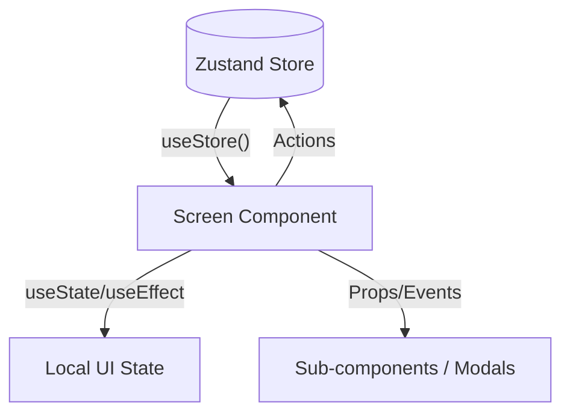
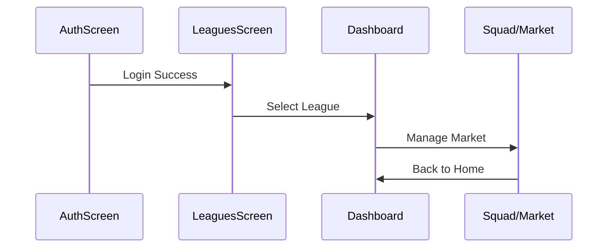

# Screens

Screens are the top-level components in the Fantalega Mobile application, representing individual views or pages. They orchestrate the interaction between the global Zustand store and the UI, managing local state while providing the primary user interface for specific features.

## Responsibility

Each screen owns the layout and interaction logic for a major functional area of the app. They are responsible for:
- Selecting necessary data from the global Zustand store.
- Managing local UI state (e.g., tab selection, search queries, countdown timers).
- Triggering store actions in response to user events.
- Handling navigation transitions to other screens.

## Architecture



## Key Files

- `src/screens/AuthScreen.tsx` — Handles login, registration, and password recovery. Connects to `authSlice`.
- `src/screens/DashboardScreen.tsx` — The main hub for a league. Displays standings summaries, countdowns, and quick actions.
- `src/screens/LeaguesScreen.tsx` — League selection, creation (multi-step wizard), and management.
- `src/screens/SquadScreen.tsx` — The fantasy market and roster management interface.
- `src/screens/FantasyAdminScreen.tsx` — Complex administrative interface for managing matchdays, bonuses, and scoring calculations.

## Primary Flow

### User Journey



## Connection to Zustand Store

Screens connect to the store using the `useStore` hook. They typically select only the slices of state they need to minimize re-renders.

### Example Pattern
```typescript
// src/screens/DashboardScreen.tsx
const leagues = useStore(state => state.leagues);
const activeLeagueId = useStore(state => state.activeLeagueId);
const league = leagues.find(l => l.id === activeLeagueId);
```

### Common Actions Used
- `src/store/slices/authSlice.ts:signIn()`
- `src/store/slices/leagueSlice.ts:addLeague()`
- `src/store/slices/fantasySlice.ts:updateFantasyTeam()`
- `src/store/slices/syncSlice.ts:syncAllData()`

## Related Documents

- [High-Level Design](../high-level-design.md)
- [Navigation](../navigation/README.md)
- [Components](../components/README.md)
