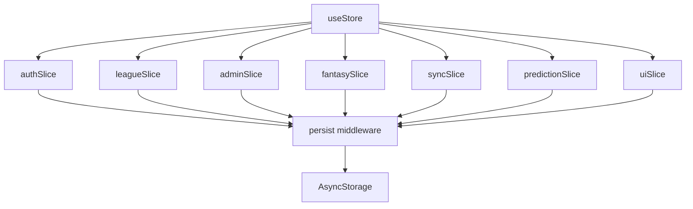
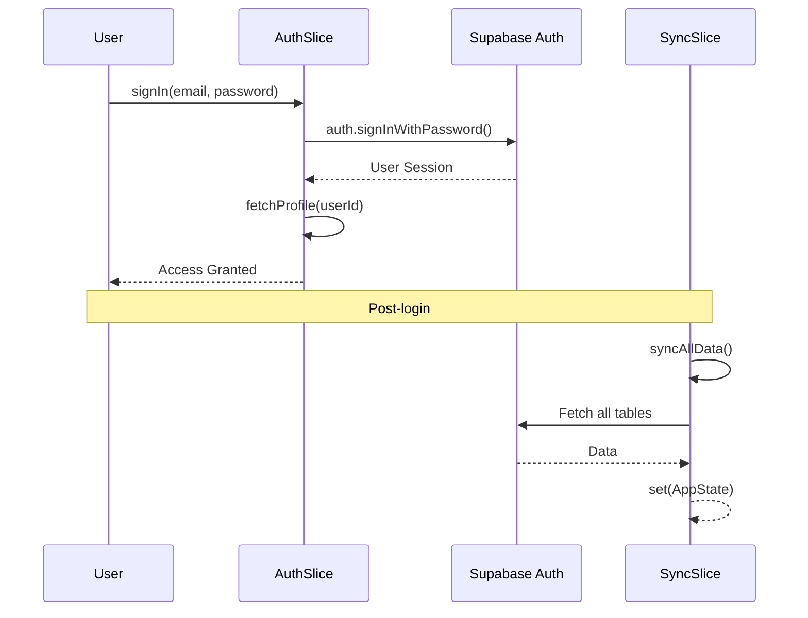
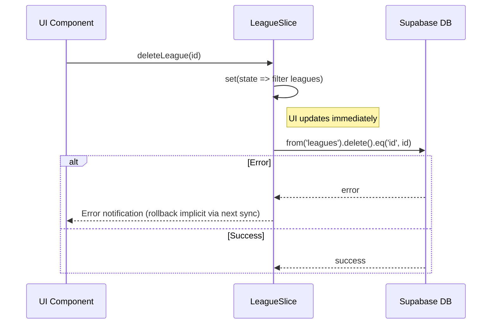

# Store Component

The `store` component manages the global application state using [Zustand](https://github.com/pmndrs/zustand).

## Responsibility
It provides a single source of truth for all application data, including user authentication, league details, match information, and fantasy team lineups. It handles data persistence across app restarts and synchronizes local state with the Supabase backend.

## Architecture
The store is built using a slice-based architecture, where different domains are managed by separate files but combined into a single store.

## Key Files
- `src/store/index.ts`: Combines all slices and configures persistence and migrations.
- `src/store/slices/authSlice.ts`: Manages user authentication and profile data.
- `src/store/slices/syncSlice.ts`: Orchestrates full data synchronization from Supabase.
- `src/store/slices/leagueSlice.ts`: Handles league creation, joining, and role management.
- `src/store/slices/adminSlice.ts`: CRUD operations for real teams, players, and matches.
- `src/store/slices/fantasySlice.ts`: Manages fantasy teams and weekly lineups.

## Key Interfaces / Types
- `src/store/index.ts:AppState`: The combined interface representing the entire store state.
- `src/store/slices/uiSlice.ts:Notification`: Defines the structure for global UI notifications.

## Flows

### Authentication & Initialization

### Optimistic Update (Example: League Deletion)

## Configuration
- **Storage**: Uses `@react-native-async-storage/async-storage`.
- **Name**: `fantalega-storage`.
- **Version**: 2 (includes migration logic for players and matches).

## Dependencies
- `zustand`: State management library.
- `zustand/middleware`: Specifically `persist` for local storage.
- `AsyncStorage`: React Native local storage implementation.

## Error Handling
Most slices use `handleError` from `src/lib/error-handler.ts`. Slices that perform async operations usually set `loading: true` via `uiSlice:setLoading` and use `try/catch/finally` blocks to ensure state consistency and UI feedback.

## Related Documents
- [Data Model](data-model.md)
- [Lib Component](../lib/README.md)
