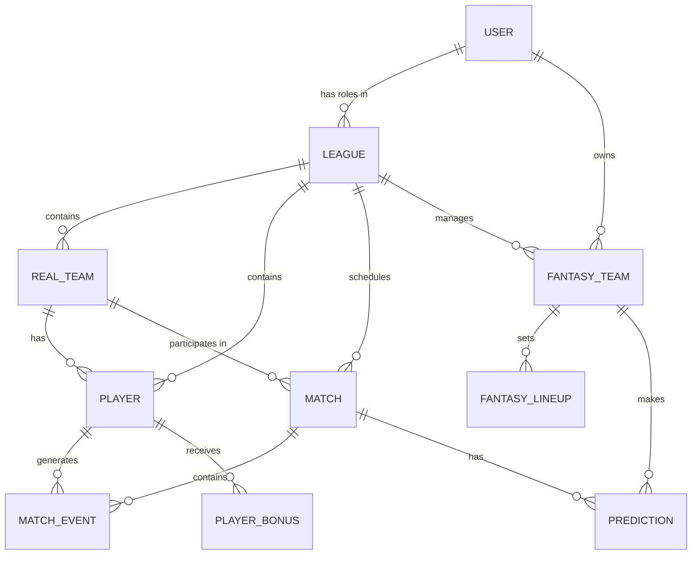

# Store Data Model

This document describes the entities managed by the Zustand store and their relationships.

## Entity Relationship

## Entities

### User (`src/types/index.ts:User`)
Represents an authenticated user in the system.
- `id`: Unique identifier (from Supabase Auth).
- `email`: User email address.
- `firstName`, `lastName`: Profile details.
- `hiddenLeagues`: List of league IDs the user chose to hide from their dashboard.

### League (`src/types/index.ts:League`)
The container for a tournament or fantasy league.
- `id`: Unique identifier.
- `name`: Name of the tournament.
- `type`: 'campionato', 'gironi', etc.
- `roles`: Dictionary mapping `userId` to `Role` ('admin', 'organizer', 'user').
- `settings`: Complex object defining budget, squad size, scoring rules, and tournament structure.
- `joinCode`: Code used by users to join the league.

### RealTeam (`src/types/index.ts:RealTeam`)
A team participating in a tournament.
- `id`: Unique identifier.
- `name`, `logo`: Team details.
- `leagueId`: Reference to the parent League.
- `groupId`: (Optional) Reference to a group in tournament formats with stages.

### Player (`src/types/index.ts:Player`)
A real player belonging to a RealTeam.
- `id`: Unique identifier.
- `name`: Player name.
- `position`: Fantasy position/category.
- `realPosition`: (Optional) Detailed football position.
- `price`: (Optional) Quotation for fantasy market.
- `realTeamId`: Reference to the RealTeam.
- `leagueId`: Reference to the League.

### Match (`src/types/index.ts:Match`)
A game between two RealTeams.
- `id`: Unique identifier.
- `leagueId`: Reference to the League.
- `matchday`: The round number.
- `homeTeamId`, `awayTeamId`: References to RealTeams.
- `homeScore`, `awayScore`: Final or current scores.
- `events`: List of `MatchEvent` objects (goals, cards, etc.).
- `playerVotes`: Map of `playerId` to base vote (for manual scoring).
- `status`: 'scheduled', 'in_progress', or 'finished'.
- `isFantasyMatchday`: Boolean flag indicating if this match counts for fantasy points.

### FantasyTeam (`src/types/index.ts:FantasyTeam`)
A user-created team in a League.
- `id`: Unique identifier.
- `userId`: Owner of the team.
- `leagueId`: Reference to the League.
- `name`: Fantasy team name.
- `players`: List of `playerId` strings.
- `totalPoints`: Accumulated points across all matchdays.

### FantasyLineup (`src/types/index.ts:FantasyLineup`)
The specific formation submitted by a FantasyTeam for a given matchday.
- `id`: Unique identifier (usually `fantasyTeamId_matchday`).
- `matchday`: The round number.
- `starters`: Map of field position to `playerId`.
- `bench`: Ordered list of `playerId` for substitutions.
- `playerPointsDetails`: Breakdown of points for each player (base vote + bonuses).

### Prediction (`src/types/index.ts:Prediction`)
A score prediction made by a user for a Match.
- `matchId`, `fantasyTeamId`, `tournamentId`: References.
- `homeScore`, `awayScore`: Predicted scores.

### PlayerBonus (`src/types/index.ts:PlayerBonus`)
Additional bonuses/penalties assigned to a player outside of standard match events.
- `playerId`, `leagueId`: References.
- `value`: Numerical bonus value.
- `type`: 'field' or 'extra'.
